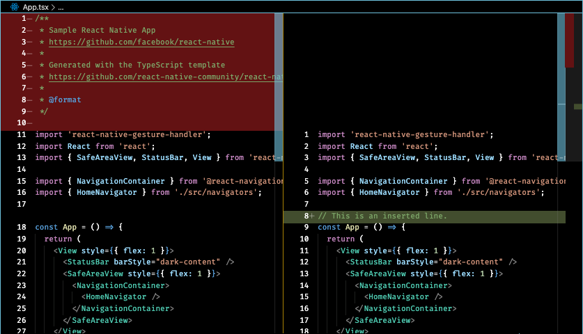

# High Contrast by Millennius Labs

## A theme based on VSCode High Contrast with some essential tweaks.



The extension is hosted on the [Visual Studio Code Marketplace](https://marketplace.visualstudio.com/items?itemName=MillenniusLabs.millennius-high-contrast).

* Drop to terminal and write the following:

```bash
code --install-extension MillenniusLabs.millennius-high-contrast
```
* Alternatively, search for *Millennius High Contrast* inside of VS Code.

### Changelog

See [CHANGELOG.md](./CHANGELOG.md) for historical changelogs.

## Follow development

### Contribute

Head over to the [GitHub Repository](https://github.com/MillenniusLabs/vscode-high-contrast) to contribute.

**Enjoy!**
